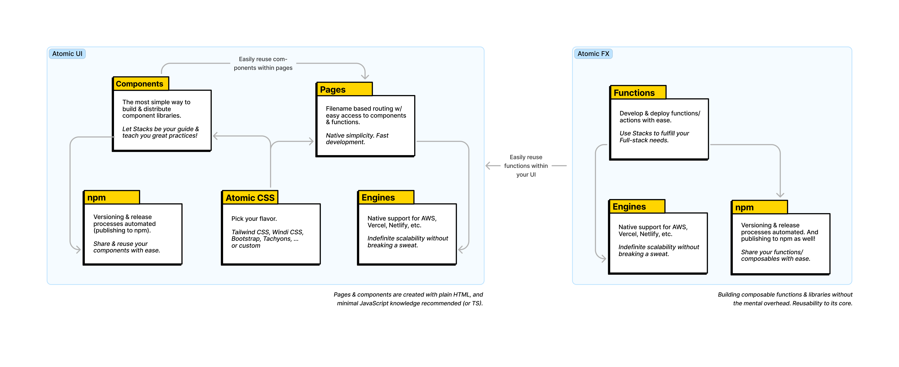

# Composability-First Design

What is the Composability-First Design pattern? Also known as "Atomic-First Design," read along for an explanation and to learn more about how these design principles to improve your development experience (DX).

## The Why

Building complex components is oftentimes difficult using traditional development & design approaches. In addition to the already many questions a developer has to answer: _should I use Vue? React? Svelte, Solid, or Angular? How do I distribute it via a package manager, like npm?_ Over time, questions like these become exhausting to answer, while trying to find "the best tech stack."

It is interesting to note that this is not necessarily due to the complexity of the development tasks required but rather due to the sheer amount of moving pieces required to build & engineer truly composable libraries. You may have already asked yourself one or many of the following questions/scenarios:

- Which code style should be followed?
- Code formatting setup _(e.g. Eslint, tslint, Prettier, etc.)_
- Create a custom, project-specific CI _(e.g. GitHub Actions, Circle CI, Travis CI, etc.)_
- Automatic library changelog generations upon releases, based on git naming conventions
- Distribution channels setup _(e.g. package managers like npm & CDNs)_
- Create a documentation site/web presence for the library
- Does your IDE help as much as it possibly could?

No matter which component or function library you are building, these concerns all have to be—and should be—addressed, one way or another.

## What is a Composable/Atomic Library?

Have you ever needed to reuse one of your components from Project A in Project B? Or have you ever needed to access a project-specific function from Project B? How about a beautiful, working modal experience? Or calendar components?

In concept, you can characterize a "composable library" as a collection of components and/or functions that is broken down to its core, in order to be optimized for reusability. This allows anyone to require them (components and/or functions) into anyone's projects.

>Think of Lodash for "functions," and minimal HTML for the "components."

## How do I know if it's right for me?

When wanting to adapt the "Composability-First Design" pattern, you will want to ask the following questions to identify whether or not this design pattern is a fit for you:

- Are you developing a UI component library or a function library? Or both?
- How is the library styled, if styling is required at all?
  - Tailwind CSS, Windi CSS, Bootstrap, Tachyons? Or something else/custom?
  - In case styling is required, are "icons" utilized within the UI?
- How is the library distributed across different code bases? npm and/or CDNs?
- Is the library meant to be built for max compatibility?

_Both components & functions should be designed with reusability (composability) in mind._

## The How

describe with code examples from readmes

### The Atomic Core

As you can see in the "Atomic Design" diagram above, there are two core atomic engines:

1. The Atomic UI engine
2. The Atomic FX engine

The Atomic UI engine, at its core, is made up of an instant atomic CSS engine, coupled with several UI techniques to ensure the most reusable and composable UI experience. To quote Adam Wathan, the creator of Tailwind CSS:

>Maintaining a utility-first (atomic) CSS project turns out to be a lot easier than maintaining a large CSS codebase, simply because HTML is so much easier to maintain than CSS. Large companies like GitHub, Netflix, Heroku, Kickstarter, Twitch, Segment, and more are using this approach with great success.

Much has been written about atomic CSS engines, in particular, because CSS is "notoriously hard to scale" (Sarah Dayan of Algolia). If you like to hear about other experiences, check out the following resources: Some resources on the benefits of scaling via an atomic approach:

- [By The Numbers: A Year and a Half with Atomic CSS](https://medium.com/@johnpolacek/by-the-numbers-a-year-and-half-with-atomic-css-39d75b1263b4) by John Polacek
- [The Case for Atomic/Utility-First CSS, curated by John Polacek](https://johnpolacek.github.io/the-case-for-atomic-css/) by John Polacek
- [Building a Scalable CSS Architecture](https://blog.algolia.com/redesigning-our-docs-part-4-building-a-scalable-css-architecture/) by Sarah Dayan of Algolia
- [No, Utility Classes Aren’t the Same As Inline Styles](https://frontstuff.io/no-utility-classes-arent-the-same-as-inline-styles) by Sarah Dayan of Algolia
- [Diana Mounter on using utility classes at GitHub](http://www.fullstackradio.com/75) a Fullstack Radio podcast interview

### Maintainability Concerns

Maintainability concerns are a major reason & inspiration for an atomic UI/FX engine.
